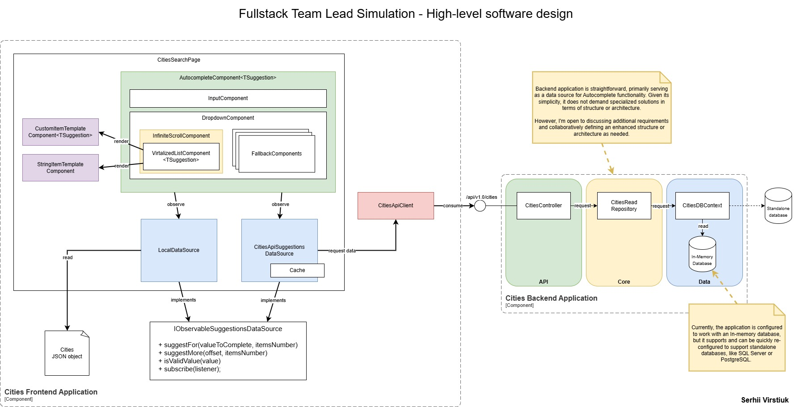

# Fullstack Team Lead Simulation
## How to run
The easiest way to get started is by sequentially running the scripts located in the repository's root folder:
- run-backend.sh
- run-frontend.sh

Please, ensure `dotnet` and `node.js` installed.

In case of any issues with these files, you can try these options:
- Open Backend Solution in Visual Studio/Rider and start from UI.
- Open Terminal in the `Frontend` folder and type: nom run dev.s

Due to time constraints, docker-compose files were not prepared.

## Deliverables
- React.js application with the autocomplete component.
- Backend that is written in C# with an autocomplete endpoint.
- High-level software design diagram of the frontend and backend system.

## Assumptions
As this is a home assignment intended to be completed outside of work hours, I opted to make a few assumptions rather than initiating a clarification process:
- **Custom Implementation:** I assumed that the majority of the components required for the AutocompleteComponent should be implemented from scratch, rather than relying on pre-built solutions. While using third-party components is generally more efficient and preferable in real-world projects, I limited their use here to demonstrate my knowledge in React.
- **Backend Setup:** I assumed that utilizing an in-memory database for the backend, which is populated at application startup, is acceptable given the time constraints of the assignment.
- **Component Functionality:** The component is designed to render 10 items at a time while supporting a full list of approximately 50,000 entries that can be scrolled.
- **Initial Setup:** I assumed that using the lightweight and fast Vite for development would be acceptable to enable a quicker start, as opposed to the outdated create-react-app or the more robust but unnecessary for this case Next.js.

## Scope
### Autocomplete component
#### In scope
- Flexibility in Data Sources (Local and API, );
- Customizable Rendering (templates for items, support of models as suggestion type);
- Efficient Data Handling (virtualization, batch data loading);
- Performace (debouncing, memoization, reduction of redundant calls/renders);
- State Representation (error fallback, warnings, loading state).

#### Out of scope
- Keyboard Navigation;
- Accessibility (WCAG, etc.);
- Responsibe Layout for demo page.

### Backend application
#### In scope
- API endpoint (with support of cancellation);
- In-memory database;
- Filtering and Paging;
- Testing middleware (error and delay simulation).

#### Out of scope
- Standalone database usage;
- Enterprise architexture approaches.

## High-level software design diagram

